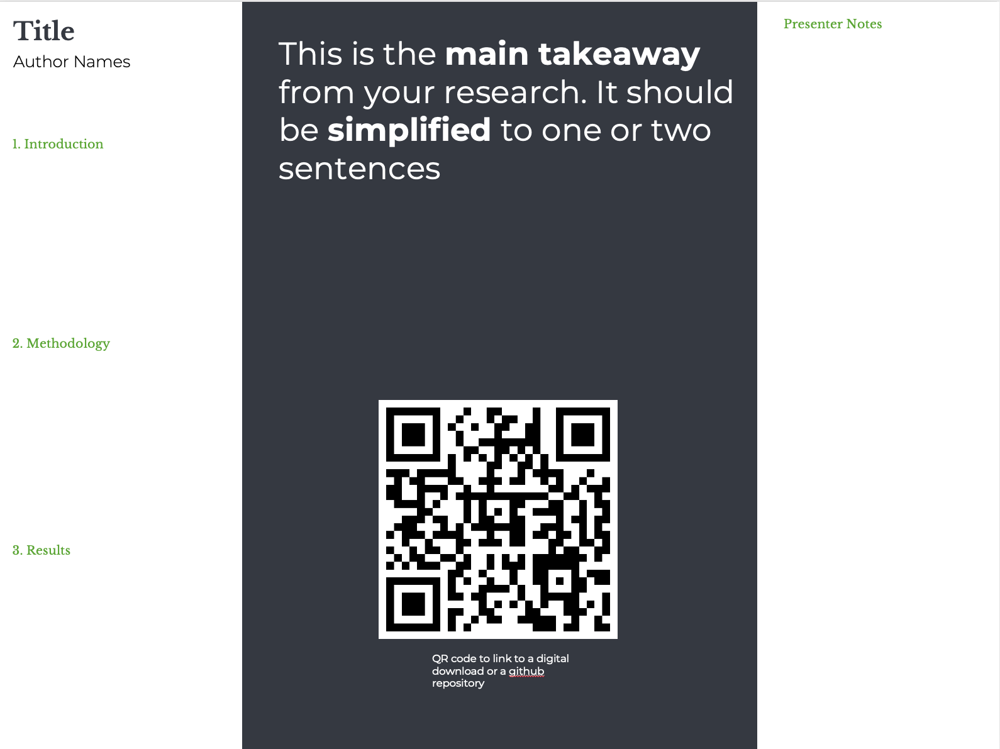

# When the Post(er)-Man Rings Twice - Make Your Science Sexy
Josua Böser, Chrestos Chrestos Concept GmbH & Co. KG, Essen, Germany

## Abstract
Scientific posters are essential for communicating research findings to a broader audience. Unfortunately, their importance tends to be overlooked, and many researchers struggle to create informative and visually appealing posters. A lack in this skillset often results in hard work going unnoticed, which poses a significant loss to the scientific community.This paper presents a comprehensive guide to creating more captivating scientific posters. It provides practical tools for researchers to improve their overall presentation and design skills, including tips on layout, color schemes, and data visualization. Additionally, we review classic and modern poster designs, offering recommendations on presentation style and facilitation. Using the recommendations outlined in this paper, researchers can acquire tools to morph their posters into a dazzling work of art, capturing their audience's attention and ensuring their research is understood and appreciated. So, when the post(er)-man rings twice, be prepared to make your science sexy!

## Introduction

Scientific posters serve as a crucial medium for the dissemination of research findings. They offer a platform for researchers to present their work in a visually appealing and concise manner, facilitating the exchange of ideas and fostering scientific discussions. Despite their significance, the art of creating an effective scientific poster is often overlooked in academic training. This paper aims to bridge this gap by providing a comprehensive guide to creating engaging and informative scientific posters.

The importance of scientific posters extends beyond mere aesthetics. A well-designed poster can captivate the audience's attention, simplify complex information, and promote the researcher's work effectively. Conversely, a poorly designed poster can obscure the research message and deter potential discussions. Therefore, mastering the art of poster creation is an essential skill for any researcher.

This paper will delve into the key elements of a successful poster, discuss the principles of design and classical and modern design. It will also provide a step-by-step guide to creating a scientific poster, offering practical tips and recommendations along the way. By the end of this paper, researchers will be equipped with the tools to transform their scientific findings into a visually compelling and informative poster.

The general structure of this paper is to be as easiliy understood as possible. To achiev this every chapter is written mostly in a table form. The goal is to summarize every peace of 
The source code of this paper can be accessed under https://github.com/UnfriendlySpider/How_to_Poster. I am happy to converse with everyone who is interessted in this topic. There are a lot of different ideads and opinions in this area and I am always happy to get additional information.

## Main Body

### Principles of Effective Scientific Communication [1]

Since ancient times, humans have been natural storytellers. It seems intrinsic to our nature to convey experiences, knowledge, and discoveries. This penchant for narratives is deeply embedded within us, making us discerning listeners, readers, and observers. We can intuitively judge when a narrative lacks coherence, depth, or appeal. The same discernment can be harnessed when crafting content for a scientific poster. Think of your poster as a structured narrative you wish to share with peers, mentors, and even the lay audience. Gather feedback and refine it. Don’t be disheartened by critiques; mastery comes with practice and iteration.

The most compelling narratives often follow fundamental principles of effective communication. In Doumont's "The Three Laws of Professional Communication" [1], we find invaluable guidelines that can be adeptly applied to scientific poster design.

| Key Principle                          | Description |
| -------------------------------------- | ----------- |
| **Clear Purpose**                      | Before embarking on the design process, define your core message. What are the essential takeaways for the audience? Prioritize clarity over excessive detail.|
| **Mind the Audience**                  | Always design with your audience at the forefront. Understand that while you are deeply immersed in the subject, your audience might be coming in with varying degrees of familiarity. Aim to craft a poster that is both comprehensive for experts and comprehensible for novices. Remember, your goal is engagement and understanding, not overwhelming with jargon or data. You want the audience to understand you and not convince them that you are smart (which can also be a purpose, but this would be mostly thought of as a bad way to use science). Be smart. Don't sound smart.|
| **Reduce Noise-to-Content Ratio**      | In a quest for comprehensiveness, avoid clutter. Every element on your poster should serve a purpose. Eliminate distractions that detract from your core message. Strive for a balance between aesthetic appeal and informative content. As a guiding thought: the audience should leave with clarity on your research, not just admiration for the design.|
| **Incorporate Effective Redundancies** | Repetition can serve as an anchor for key points. Use this tool sparingly. Emphasize crucial information, perhaps through visual aids like charts, and reiterate its importance in sections like the conclusion.|

The versatility of posters as a medium offers researchers a canvas brimming with possibilities. While creativity in design is encouraged, adhering to established principles of communication ensures that your scientific narrative is easiliy understood. Try to find a balance between interessting new designs and easily understandable established ways. 

Whether designing a poster, penning a paper, or delivering a presentation, keeping these foundational principles at the heart of your effort will set you on the path to effective scientific communication.

### Concept Creation
The most important aspect of creating content is to have a clear understanding of what you want to achieve with your creation. There are multiple reasons for creating a poster, with maybe the clearest being to show other people your own science. However, there can be numerous other reasons that influence your output or your creation process. It is always important to remember these reasons, as sometimes you need to tweak your poster design into certain direction to achieve your real purpose.

For example, If you want to have feedback about your research your poster should be more detailed and suited to a knowlegdable audience. If you want to promote your research you can simplify your poster that people outside your field understand it. 

The following table contains a few reasons, but if you really want to be sure about your creation think about them yourself. The resaons don't need to be great, but you will have an easier time creating by beeing clear about what you want to achieve.

|  Creation Reasons                    | Description |
| -----------------------------------  | ----------- |
| **Promoting your Research**          | A poster provides a platform to showcase your research in a concise and visually appealing manner, allowing attendees to grasp the main concepts quickly. |
| **Networking**                       | Scientific posters, especially at conferences, can serve as an icebreaker, inviting conversations, collaborations, and connections with peers and experts in the field. |
| **Educational Outreach**             | A well-designed poster can be an excellent tool for educational purposes, breaking down complex ideas into digestible formats suitable for students or the general public. |
| **Soliciting Feedback**              | Presenting preliminary or ongoing research in a poster format allows you to receive constructive feedback, suggestions, or new perspectives from colleagues, potentially guiding future work. |
| **Professional Development**         | Designing and presenting a poster can be a valuable skill development exercise, honing communication skills and enhancing your ability to present scientific concepts succinctly. |
| **Increasing Visibility**            | Especially at large conferences or events, having a poster can ensure your work stands out and is recognized, adding to both your personal and your research's visibility. |
| **Supporting Grant or Funding Applications** | High-quality posters can serve as evidence of the productivity and impact of your research when seeking financial support or grant renewals. |

### Classical or Modern?
This chapter is more a part of the starting steps chapter, but as I find it 
The classical poster design is and old evaluated layout, but if you are a little courageus you can try to create a billboard poster. It is also called the Poster 2.0 and could be one of the designs of the future. We will talk about that later and a lot of the tipps for a classical poster can be used for a billboard poster, so don't worry. What you learn at first can be applied to the modern stuff later.

<table>
<tr>
    <td>
        
         
        Classical Desgin
    </td>
    <td>
        
         
        Billboard Design
    </td>
</tr>
</table>

### Starting steps
The initial stages of designing a scientific poster require planning. The following are steps in laying the groundwork for an effective and engaging poster:

|  Steps              | Description |
| ------------------  | ----------- |
| **Define Purpose**  | Start by outlining a clear purpose for your poster. While this can evolve as your design progresses, having a foundational goal ensures consistency and coherence throughout the development process.|
| **Poster Size**    | Find out the size that is required for the conference. The sizes can very and it talks time to adjust the size, which can be avoided by initially using the correct size |
| **Choose Layout**   | Begin with one of the fundamental layouts if you're unsure of the design direction. While innovation is encouraged, always prioritize the audience's ease of comprehension. The poster should guide viewers through its content intuitively, ensuring a logical flow. If the flow is not to intuitvaly add numbers or arrows to guide the view of the audience|
| **Create Sketch**   | A hand-drawn sketch can be a valuable preliminary tool. Sketch out your ideas on paper, noting the intended reading flow. Solicit feedback from peers to gauge the effectiveness and clarity of your proposed layout.|

❓ Where do I get templates     
<a href="https://www.posternerd.com/sciposters-templates">Posternerd</a> is a website where you can print posters, but they also provide templates. 

### General Thoughts to consider
|  Thought            | Description |
| ------------------  | ----------- |
| **Full reading time**    | One thing to consider is how much time the audience has to read your poster. If the conference is big and there are a lot of posters present you need to adjust the content of your poster to the potential time. A rule of thumb, proposed by the Undergraduate Research Center[3] is around **5 min** to read your whole poster. Does not sound a lot because it is not a lot. Plan according to that.   If your audience takes more time to read it you need to make it extra interessting. You can add a little quirk to your poster, or an interessting idea game|

### Basic Structure
A structured layout is pivotal for ensuring your scientific poster effectively communicates its content. In the table you find a breakdown of the primary components. It's a good practice to follow this structure, as it is easily understood, but you could also leave out chapters if you think it does not help your purpose. Always remember the line between understandable and innovative.

|  Structure            | Description |
| --------------------- | ----------- |
| **Title**             | Craft a title that is succinct, captivating, and indicative of the research theme. It serves as the primary hook, enticing viewers to delve deeper into the content,|
| **Introduction**      | Introduce the research theme, establishing its significance, and highlighting the study's goals. It sets the context for the subsequent sections.|
| **Methods**           | Traditionally, this section delineates the research methods, ensuring brevity and clarity. Some contemporary designs opt to omit this in favor of referencing the full paper, streamlining the poster content.|
| **Results**           | Showcase the salient outcomes of the research. Employ visual tools like graphs, charts, and tables to represent data in a digestible manner.|
| **Conclusion**        | Recapitulate the primary findings, delving into their ramifications, and propose potential avenues for subsequent research.|
| **References**        | Detail all cited works, adhering to the citation format prevalent in your discipline.|
| **Acknowledgments**   | Express gratitude to individuals or entities that played a pivotal role in the research's fruition.|
| **Contact Information** | Facilitate further engagement by providing avenues for attendees to contact you, fostering potential collaborations or discussions.|

### Formatting Tipps

|                          | Guideline |
|--------------------------|------------------------------|
| **Emphazize heading**    | To help the audience identify the different sections of your poster you can add clear sections with color, boxes, bold text or a lot of whitspace.|
| **Spacing**              | Allow sufficient space around your text and sections. This is also called "Negative Space" or "Breathing space. If there is not enough Negative Space on the poster it will feel crowded an overwhelming.|
| **Content Distribution** | Find out what the propotion of text to figure to negative space is in your poster. A Recommondation of the Undergraduate Research Center is roughly 20% text, 40% figures, and 40% space [3]. This depends on your choosen layout and your purpose, but take the message not to go overboard with text.|
| **Contrast**             | Ensure your text color contrasts well with the background. Dark text on a light background is usually the most legible. Often it is recommended to just leave the background white.|

### Crafting Text for Scientific Posters

Text is an indispensable part of a poster. Despite that it is not recommended to use the medium text as the main driver of the poster. Often people write their abstract into the Introduction, and under certain goals this could be a valid approach. But mostly a lot of the possible audience tends to avoid reading big text blocks at an event. Even if it is easier, and faster for you, to just add the abstract, think about shortening it or change it to a bullet point format.

The following contains general tipps about what you should

|  Generel tipps       | Description |
| -------------------- | ----------- |
| **Brevity**          | The essence of poster presentations is conciseness. Aim for less than 250 words for poster summaries, trimming unnecessary details without losing core information. All in all the word count should not be bigger than {500 words} [2] (without the references). Think about the around 5 minute reading time |
| **Format & Structure**                    | Consider using short passages or bullet format. Long text is hard to scim through and people often don't fully read it. Adjust this to your thought up purpose for the poster.|
| **Clarity Above All**| Avoid excessive jargon or technical terms unless they are integral to your research's communication. Always consider the diverse background of your audience.|

#### Fonts

The question that always comes up is "What about the text size". In general you can say that the text should be readable from around 2m. A fontsize of 24 to 36pt is said to reasonable for the generel text. The Title and headings should be increased according to this.

|                                           | Guideline |
|------------------------------------------ |------------------------------|
| **Text Alignment**                        | Always left-align text to prevent gaps between words and ensure better readability. Centered text can be reserved for titles or section headers. |
| **Font Style**                            | Use sans serif fonts for better readability from a distance. |
| **Font Consistency**                      | Keep heading sizes consistent for text of the same importance. |
| **Font Consistency for Emphasis**         | Avoid switching font types for emphasis. It can disrupt sentence flow. |
| **Case Sensitivity**                      | Refrain from using all UPPER CASE type as it hinders readability.  |
| **Emphasizing Techniques**                | Utilize bold face, italics, or combinations for emphasizing words and phrases.  |
| **Line Spacing**                          | Maintain appropriate line spacing (around 1.2 to 1.5) to enhance readability. Overcrowding makes text difficult to digest.|

The fontsize strongly depends on the concept and layout of the poster. The following to tables can be used as a rough example. They are proposed by the 
Undergraduate Research Center [3] and are only provided as a general guide. Don't just copy these, but look at you poster and see if the sizes are appealing to the eye in your concept:

<table align="center" width="100%">
<tr>
<td align="center" width="50%">

**Poster Section**   | **Font Size**
---------------------|--------------
Title                | 85pt (depends on the length of the title)
Authors              | 56pt
Sub-headings         | 36pt
Body text            | 24pt
Captions             | 18pt

</td>
<td style="padding-left: 50px;" align="center" width="50%">

**Legibility Distance** | **Font Size**
------------------------|---------------
6 feet                 | 30 pt
10 feet                | 48 pt
12 feet                | 60 pt
14 feet                | 72 pt

</td>
</tr> 
</table>

### Color
The next step is to think about what kind of color theme your poster is supposed to have. There are multiple way to do that, but it is a good idea to not be to colorful. If you create to much noice with a diverce color scheme people can be distracted from the actual content you want to tell them. Adjust the color of your pictures and charts to suit your prefered theme.

Often organizations have a color theme that should or is recommended to be used. If you do not have something like that you can use a recommondation from posternerd.com [4]

### Incorporating Pictures in Scientific Posters

Images serve as a potent tool for visual communication in scientific posters. Here are guidelines for their effective utilization:

|  Criteria                      | Description |
| ------------------------------ | ----------- |
| **High Resolution**            | Whenever possible, use vector graphics, which are resolution-independent and scale without any loss in quality. If vector images aren't feasible, ensure raster images are of high resolution (typically 300 dpi or higher for print).|
| **Program for Visualization**  | Utilize specialized software or programming languages tailored for data visualization, such as R, Python (with libraries like Matplotlib or Seaborn), or dedicated tools like Tableau. These allow for precision and customization in creating data plots.|
| **Consistent Style**           | Ensure that images, charts, and graphs have a consistent visual style. This cohesion ensures a professional and harmonious appearance.|
| **Captions and Labels**        | Every image or graph should have a concise and informative caption. All axes and data points should be clearly labeled, and legends provided where necessary.|
| **Size and Scaling**           | Adjust images to an appropriate size so they're clear without overwhelming other content. Ensure uniform scaling to prevent distortion.|
| **Image Relevance**            | Every image included should directly support the research narrative. Avoid decorative images that don't contribute to content comprehension.|
| **Copyright and Permissions**  | Ensure you have the rights to use all images. If borrowing or adapting, credit sources appropriately and ensure you've obtained necessary permissions.|

### Integrating Graphs in Scientific Posters

Graphs translate raw data into a comprehensible visual format, providing clarity and underscoring your research's salient points. Adhere to the following principles for optimal impact:

|  Criteria                       | Description |
| ------------------------------- | ----------- |
| **High Resolution**             | Always prefer vector formats for graphs to ensure scalability without quality loss. If that's not feasible, rasterized graphs should be high resolution, preferably 300 dpi or higher for printing.|
| **Visualization Software**      | Leverage specialized software or programming languages like R, Python (utilizing libraries like Matplotlib, Seaborn), or other data visualization tools such as Tableau. These offer a wide array of customization and can represent data with precision.|
| **Consistency**                 | Maintain a consistent style across all graphs, whether it's in terms of color schemes, legends, or types of graphs used. This ensures a cohesive and professional look.|
| **Clear Labeling**              | All axes should be distinctly labeled, and any units of measurement specified. Legends must be clear and placed such that they don't clutter the main graph area.|
| **Graph Type Selection**        | Opt for the graph type (e.g., bar, line, scatter) that best represents your data and the relationships you want to emphasize.|
| **Minimalistic Design**         | Avoid unnecessary gridlines, labels, or decorations that don't add value. A clutter-free graph is more comprehensible.|
| **Data Integrity**              | Ensure that the graph represents the data accurately without any distortions or misleading scales.|
| **Captions and Context**        | Each graph should have a brief caption that explains its significance. When necessary, provide short context or a description to guide interpretation.|
| **Color Choices**               | Use colors strategically. Colors should be distinguishable, and if there's a sequence or gradation, use color gradients that are easily discernible. Ensure accessibility by checking color contrast and avoiding problematic color combinations for color-blind individuals.|

### Tools for Creating Scientific Posters

A plethora of software options exists for designing scientific posters. The right tool can amplify the effectiveness of your presentation. Below is an expanded list of tools:

|         Tool       | Advantages                                                         | Disadvantages                                           |
| ------------------ | ------------------------------------------------------------------ | ------------------------------------------------------- |
| **Powerpoint**     | - Widely accessible and standard tool - Intuitive for beginners - Many available templates and easy formatting options - Compatible with numerous devices and platforms | - Limited advanced design capabilities - Can become sluggish with high-resolution images and intricate designs  |
| **Prezi**          | - Dynamic, non-linear presentations - Offers interactive elements and zooming features - Modern and engaging visual transitions  | - Learning curve for those accustomed to traditional slide formats - Not ideal for print formats - Requires internet for online version |
| **Canva**          | - User-friendly drag-and-drop interface - Vast library of templates, icons, and images - Cloud-based, facilitating collaborative work | - Limited customization in free version - High-resolution exports might require premium version - Not tailored for extensive scientific representations |
| **LaTeX with Beamer/`pgfplots`/`tikzposter`** | - High-quality typesetting, optimal for intricate scientific content - Programmable, allowing for consistent styling and repeatability - Precise control over elements and positioning | - Steeper learning curve for those unfamiliar with programming or scripting - Requires additional packages for certain design elements - Can be time-consuming for intricate designs |
| **Adobe Illustrator** | - Professional vector graphics editing tool - Offers precise control over every design element - Wide range of typography and graphics tools | - Expensive and may have a steep learning curve for beginners - Overkill for simple designs |
| **Inkscape**       | - Free, open-source vector graphics editor - Similar capabilities to Adobe Illustrator for many tasks - Extensive community support | - Might feel less polished than premium tools - Some features less intuitive than other vector tools |
| **GIMP**           | - Free, open-source raster graphics editor - Suitable for image manipulation and poster design | - Not specifically tailored for poster creation - Learning curve for those accustomed to other graphic software |
| **CorelDRAW**      | - Powerful graphic design software - Intuitive interface with a suite of design capabilities | - Paid software - Might be considered overkill for straightforward poster designs |
| **Affinity Designer** | - Professional graphic design software at a more affordable price point than Adobe products - Smooth and responsive performance - Versatile raster and vector editing capabilities | - Might have a learning curve for those new to graphic design |

### Review Process for Enhancing Poster Quality

Ensuring your poster's clarity, impact, and effectiveness necessitates a thorough review. Below are some recommended strategies:

|                    | Description |
| ------------------ | ----------- |
| **Peer Review** | Share your poster with colleagues and experts in your field. A fresh set of eyes can provide valuable insights, point out any overlooked errors, and offer constructive criticism. |
| **Public Display** | Print a draft of your poster and pin it in a communal area, like a departmental bulletin board. Provide pens or sticky notes for viewers to jot down feedback directly on the poster. |
| **Feedback Loop** | Continual feedback is the key to refinement. Always iterate on your design based on the input you receive, and seek feedback multiple times throughout the creation process. |
| **Distance Yourself** | After designing, take a short break before reviewing. Returning with a fresh perspective can help you spot inconsistencies or areas of confusion that you might have missed initially. |
| **Professional Attitude** | Remember that critique is a stepping stone to excellence. Stay open-minded, welcome feedback with grace, and use it to elevate your work's quality. |
| **Practice Presentation** | If possible, practice presenting your poster to a small group. This will not only help you refine the poster itself but will also prepare you for the actual presentation. Their questions and reactions can offer insights into which sections may need more clarity or emphasis. |
| **Check Technical Details** | Ensure that all visuals, especially graphs and charts, are accurate. Double-check the resolution, color consistency, and alignment of all elements. |

## Summary

## References

References go at the end of your paper. This section is not required.

[1] The Three Laws of Professional Communication, JEAN-LUC DOUMONT

[2] https://subjectguides.york.ac.uk/posters/home

[3] https://urc.ucdavis.edu/sites/g/files/dgvnsk3561/files/inline-files/General%20Poster%20Design%20Principles%20-%20Handout.pdf

[4] https://www.posternerd.com/tutorials

## Acknowledgments

## Recommended Reading

https://www.posternerd.com/tutorials

## Contact Information

Your comments and questions are valued and encouraged. Contact the author at:

Josua Böser
Chrestos Chrestos Concept GmbH & Co. KG
Girardetstraße 1-5 / 45131 Essen
Work Phone: +49 160 4655151
Email: josua.boeser@chrestos.de

Brand and product names are trademarks of their respective companies.

