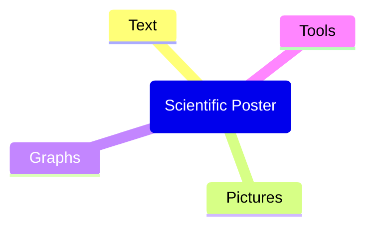

# When the Post(er)-Man Rings Twice - Make Your Science Sexy
Josua Böser, Chrestos Chrestos Concept GmbH & Co. KG, Essen, Germany

## ABSTRACT
Scientific posters are essential for communicating research findings to a broader audience. Unfortunately, their importance tends to be overlooked, and many researchers struggle to create informative and visually appealing posters. A lack in this skillset often results in hard work going unnoticed, which poses a significant loss to the scientific community.This paper presents a comprehensive guide to creating more captivating scientific posters. It provides practical tools for researchers to improve their overall presentation and design skills, including tips on layout, color schemes, and data visualization. Additionally, we review classic and modern poster designs, offering recommendations on presentation style and facilitation.Using the recommendations outlined in this paper, researchers can acquire tools to morph their posters into a dazzling work of art, capturing their audience's attention and ensuring their research is understood and appreciated.So, when the post(er)-man rings twice, be prepared to make your science sexy!

## INTRODUCTION

Scientific posters serve as a crucial medium for the dissemination of research findings. They offer a platform for researchers to present their work in a visually appealing and concise manner, facilitating the exchange of ideas and fostering scientific discussions. Despite their significance, the art of creating an effective scientific poster is often overlooked in academic training. This paper aims to bridge this gap by providing a comprehensive guide to creating engaging and informative scientific posters.

The importance of scientific posters extends beyond mere aesthetics. A well-designed poster can captivate the audience's attention, simplify complex information, and promote the researcher's work effectively. Conversely, a poorly designed poster can obscure the research message and deter potential discussions. Therefore, mastering the art of poster creation is an essential skill for any researcher.

This paper will delve into the key elements of a successful poster, discuss the principles of design, and analyze case studies of effective posters. It will also provide a step-by-step guide to creating a scientific poster, offering practical tips and recommendations along the way. By the end of this paper, researchers will be equipped with the necessary tools to transform their scientific findings into a visually compelling and informative poster.

## Main Body

### General Idea for content creations

- Know your audience and create according to them.
- Reduce the noice
  - Clarity above everything else.
  - Avoid technical terms if possible
  - Shorten where it is possible.
  - Don't waste the time of you audience.
- Add 

### Concept Creation

### Structure
A successful scientific poster is more than just a collage of text and images. It is a carefully crafted visual narrative that communicates the essence of the research in a concise and engaging manner. Here are the key elements that contribute to a successful poster:

|                    | Description |
| ------------------ | ----------- |
| Title              | The title should be concise, compelling, and descriptive. It should capture the essence of the research and draw the audience in. |
| Introduction       | This section should provide a brief overview of the research topic, its relevance, and the objectives of the study. |
| Methods            | Classicly this section should outline the methodology used in the research. It should be concise and easy to understand, allowing the audience to grasp the approach taken. Some modern approaches completely erase this section and reference to the original paper. |
| Results            | This section should present the key findings of the research. Visual aids such as graphs, charts, and tables can be used to display results effectively. |
| Conclusion         | This section should summarize the findings, discuss their implications, and suggest areas for future research. |
| References         | Any sources cited in the poster should be listed here. Ensure to follow the citation style relevant to your field. |
| Acknowledgments    | This section should acknowledge any individuals or institutions that contributed to the research. |
| Contact Information| Providing contact information allows interested viewers to reach out for further discussion or collaboration. |

The Important Aspects of a Poster, as for a presentation, is to tell a story. 

### Design Principles
The design of a scientific poster plays a crucial role in its effectiveness. A well-designed poster can enhance readability, highlight key information, and engage the audience. Here are some design principles to consider:

|             | Description |
| ----------- | ----------- |
| Hierarchy   | Information should be organized in a hierarchical manner, guiding the viewer's eye from the most important elements (like the title and key findings) to the less critical ones. |
| Consistency | Consistency in fonts, colors, and layout can make the poster look professional and easy to read. |
| Simplicity  | Avoid cluttering the poster with too much text or complex visuals. Keep the design simple and the message clear. |
| Contrast    | Use contrast to highlight key information and make the text readable. This could be contrast in color, size, or typeface. |
| Whitespace  | Whitespace, or negative space, is the area of the poster that is left unmarked. It gives the elements on the poster room to breathe and can help guide the viewer's eye. |
| Color       | Use color sparingly and purposefully. Too many colors can be distracting, while a thoughtful color scheme can enhance the poster's effectiveness. |
| Typography  | Choose fonts that are easy to read from a distance. The text size should be large enough to be read from at least a meter away. |

In the next section, we will analyze case studies of effective posters and discuss what makes them successful.

### Text
- Short. Dont waste the time of the audience. Rule of tumbs is under 250 words
- Eye catching wtihout beeing false
- Fine line between polemic and correct
- Word of play

### Pictures
- best vector graphics
- large / high resolution

### Graphs

### Tools
- Powerpoint
- Prezi
- Latex (tikzposter)

## CONCLUSION

The conclusion summarises your paper and ties together any loose ends. You can use the conclusion to make any final points such as recommendations predictions, or judgments.

## REFERENCES

References go at the end of your paper. This section is not required.

## ACKNOWLEDGMENTS

## RECOMMENDED READING

Recommended reading lists go after your acknowledgments. This section is not required.

## CONTACT INFORMATION

Your comments and questions are valued and encouraged. Contact the author at:

Josua Böser
Chrestos Chrestos Concept GmbH & Co. KG
Girardetstraße 1-5 / 45131 Essen
Work Phone: +49 160 4655151
Email: josua.boeser@chrestos.de

Brand and product names are trademarks of their respective companies.